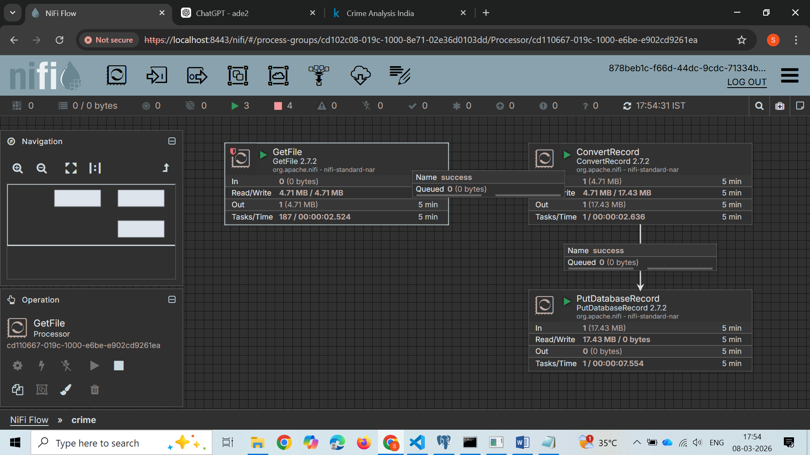
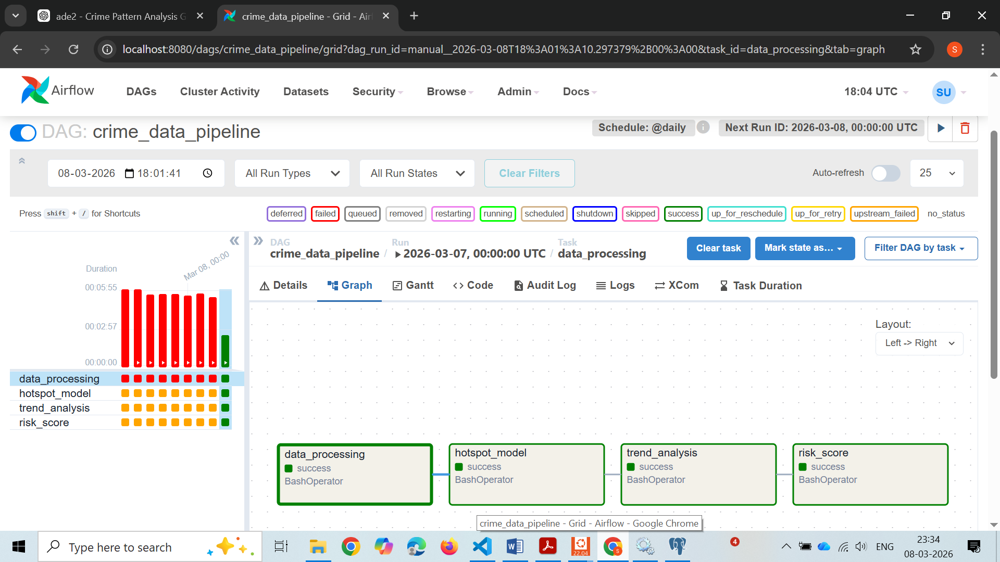
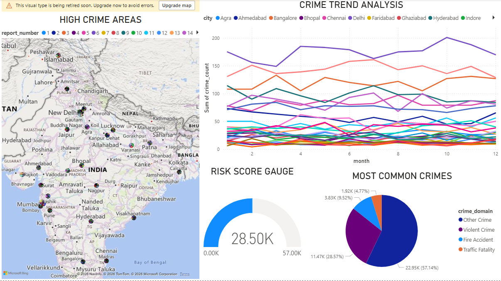

# Crime Pattern Analysis Pipeline using NiFi, Airflow, PostgreSQL and Power BI

# Project Overview
This project implements an end-to-end data engineering pipeline to analyze crime patterns and generate insights. The system ingests crime data using Apache NiFi, stores the raw data in PostgreSQL, processes the data using Apache Airflow ETL pipelines and Python scripts, and visualizes insights using Power BI dashboards.

The objective of the project is to detect crime hotspots, analyze crime trends, and estimate risk levels to help understand crime distribution patterns.

# System Architecture

Crime Data  
↓  
Apache NiFi Data Ingestion  
↓  
PostgreSQL Raw Data Storage  
↓  
Apache Airflow ETL Pipeline  
↓  
PostgreSQL Processed Data  
↓  
Power BI Dashboard  

# Technologies Used

- Apache NiFi for data ingestion
- Apache Airflow for workflow orchestration and ETL automation
- Python for data processing and machine learning
- PostgreSQL for database storage
- Pandas for data manipulation
- Scikit-learn for machine learning algorithms
- Power BI for data visualization and dashboard creation

# Data Pipeline Workflow

1. Crime dataset is ingested using Apache NiFi.
2. NiFi loads the raw dataset into PostgreSQL.
3. Apache Airflow schedules and executes the ETL pipeline.
4. Python scripts clean, transform and analyze the data.
5. Machine learning algorithms identify crime hotspots.
6. Processed results are stored in PostgreSQL tables.
7. Power BI connects to PostgreSQL and visualizes the data.

# Apache NiFi Data Ingestion

Apache NiFi is used to automate the ingestion of the crime dataset.

The NiFi pipeline performs the following tasks:

- Reads the crime dataset from a directory
- Converts and processes the file format
- Loads the dataset into PostgreSQL

This ensures automated and scalable data ingestion.

# Apache Airflow ETL Pipeline

Apache Airflow automates the data processing workflow using a DAG.

The DAG contains the following tasks.

Data Processing  
Cleans and preprocesses the crime dataset.

Hotspot Detection  
Applies clustering algorithms to detect crime hotspots.

Trend Analysis  
Analyzes monthly crime trends.

Risk Score Calculation  
Calculates a crime risk score for each location.

# Machine Learning Algorithm

The project uses K-Means clustering to detect crime hotspots.

Algorithm used  
K-Means Clustering

Purpose  
Group locations with similar crime patterns and identify high crime areas.

Library used  
Scikit-learn

# PostgreSQL Database Tables

The processed data is stored in PostgreSQL using the following tables.

- crime_raw
- crime_processed
- crime_hotspots
- crime_trends
- crime_risk_scores

crime_raw contains the dataset loaded by NiFi.  
crime_processed contains cleaned and transformed data.  
crime_hotspots contains hotspot clusters identified using machine learning.  
crime_trends stores crime trends over time.  
crime_risk_scores contains calculated crime risk levels.

# Dashboard Visualizations

The Power BI dashboard provides the following visual insights.

Crime Hotspot Map  
Displays locations with high crime activity.

Crime Trend Analysis  
Line chart showing crime increase or decrease over time.

Risk Score Gauge  
Displays the crime risk level.

Crime Type Distribution  
Pie chart showing the most frequent crime categories.

# How to Run the Project

Step 1 Start Apache NiFi  
Run NiFi and execute the data ingestion pipeline.

Step 2 Start Apache Airflow

airflow scheduler  
airflow webserver -p 8080

Step 3 Trigger the Pipeline

Open the Airflow interface in the browser.

http://localhost:8080

Run the DAG named

crime_data_pipeline

Step 4 Verify Data in PostgreSQL

Open pgAdmin and run queries such as

SELECT * FROM crime_hotspots;

Step 5 Open Power BI Dashboard

Refresh the Power BI dashboard to view updated insights.

# Project Outcomes

- Automated data ingestion using Apache NiFi
- Automated ETL pipeline using Apache Airflow
- Crime hotspot detection using machine learning
- Centralized data storage using PostgreSQL
- Interactive crime analytics dashboard using Power BI

# Future Improvements

- Integrate real-time crime data streaming
- Add predictive crime models
- Deploy dashboard as a web application

# Author

Sonali S